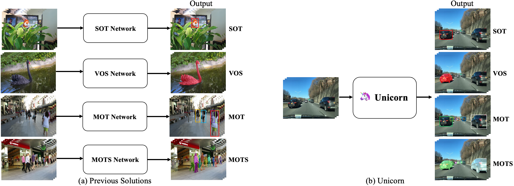
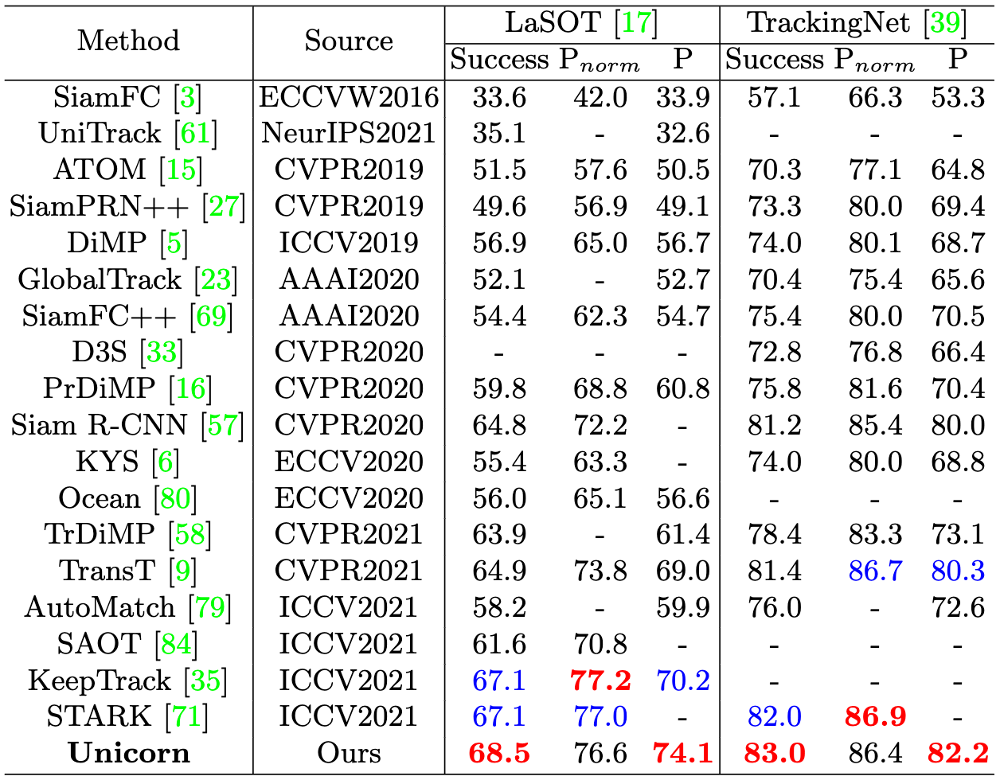
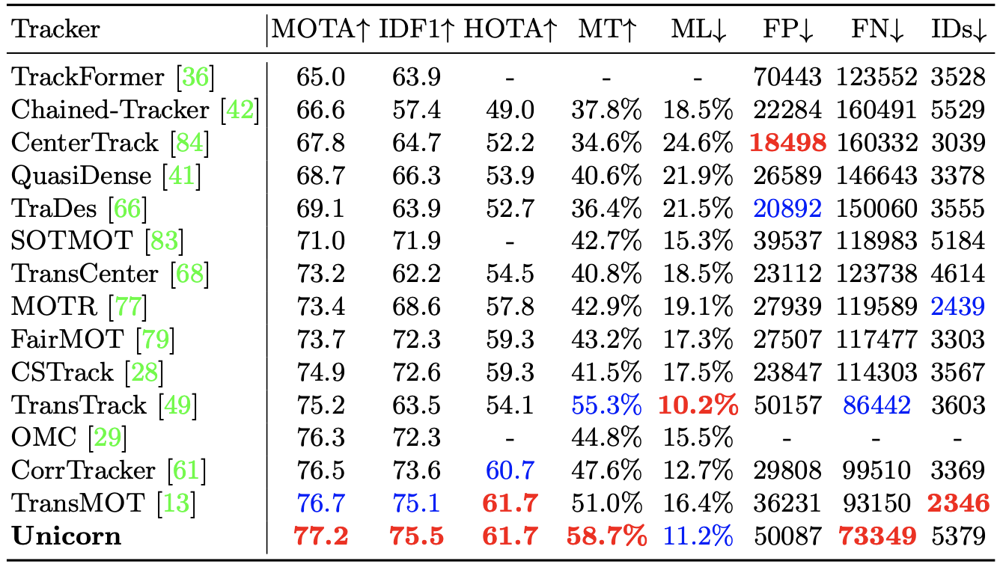
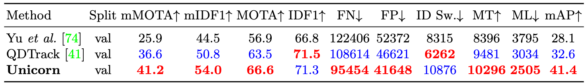
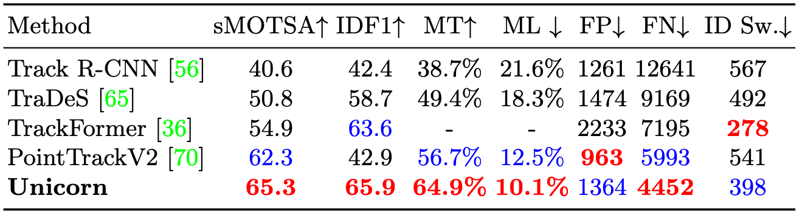
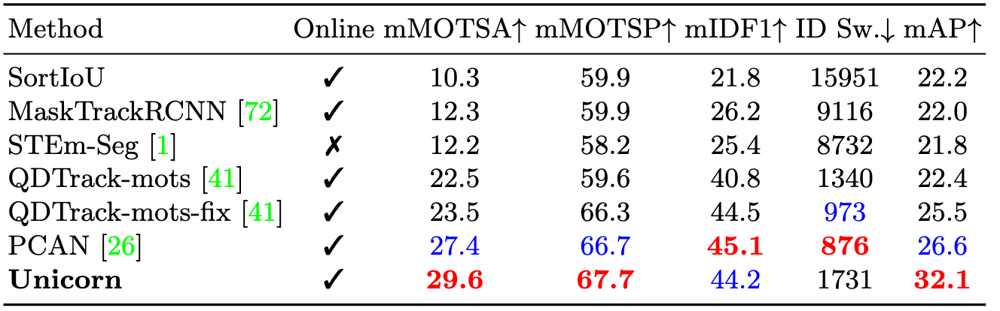

## Unicorn :unicorn: : Towards Grand Unification of Object Tracking

[](https://paperswithcode.com/sota/multiple-object-tracking-on-bdd100k?p=towards-grand-unification-of-object-tracking)
[](https://paperswithcode.com/sota/multi-object-tracking-and-segmentation-on-2?p=towards-grand-unification-of-object-tracking)
[](https://paperswithcode.com/sota/multi-object-tracking-on-mots20?p=towards-grand-unification-of-object-tracking)
[](https://paperswithcode.com/sota/visual-object-tracking-on-lasot?p=towards-grand-unification-of-object-tracking)
[](https://paperswithcode.com/sota/visual-object-tracking-on-trackingnet?p=towards-grand-unification-of-object-tracking)
[](https://paperswithcode.com/sota/multi-object-tracking-on-mot17?p=towards-grand-unification-of-object-tracking)



This repository is the project page for the paper [Towards Grand Unification of Object Tracking](https://arxiv.org/abs/2207.07078)

## Highlight
- Unicorn is accepted to ECCV 2022 as an **oral presentation**!
- Unicorn first demonstrates grand unification for **four object-tracking tasks**.
- Unicorn achieves strong performance in **eight tracking benchmarks**. 

## Introduction
- The object tracking field mainly consists of four sub-tasks: Single Object Tracking (SOT), Multiple Object Tracking (MOT), Video Object Segmentation (VOS), and Multi-Object Tracking and Segmentation (MOTS). Most previous approaches are developed for only one of or part of the sub-tasks. 

- For the first time, Unicorn accomplishes the great unification of the network architecture and the learning paradigm for **four tracking tasks**. Besides, Unicorn puts forwards new state-of-the-art performance on many challenging tracking benchmarks **using the same model parameters**.

This repository supports the following tasks:

Image-level
- Object Detection
- Instance Segmentation

Video-level
- Single Object Tracking (SOT)
- Multiple Object Tracking (MOT)
- Video Object Segmentation (VOS)
- Multi-Object Tracking and Segmentation (MOTS)

## Demo
Unicorn conquers four tracking tasks (SOT, MOT, VOS, MOTS) using **the same network** with **the same parameters**.

<div align="center">
  
</div>

## Results
### SOT
<div align="center">

</div>

### MOT (MOT17)
<div align="center">

</div>

### MOT (BDD100K) 
<div align="center">

</div>

### VOS
<div align="center">

</div>

### MOTS (MOTS Challenge)
<div align="center">

</div>

### MOTS (BDD100K MOTS)
<div align="center">

</div>

## Getting started
1. Installation: Please refer to [install.md](assets/install.md) for more details.
2. Data preparation: Please refer to [data.md](assets/data.md) for more details.
3. Training: Please refer to [train.md](assets/train.md) for more details.
4. Testing: Please refer to [test.md](assets/test.md) for more details. 
5. Model zoo: Please refer to [model_zoo.md](assets/model_zoo.md) for more details.


## Citing Unicorn
If you find Unicorn useful in your research, please consider citing:
```bibtex
@inproceedings{unicorn,
  title={Towards Grand Unification of Object Tracking},
  author={Yan, Bin and Jiang, Yi and Sun, Peize and Wang, Dong and Yuan, Zehuan and Luo, Ping and Lu, Huchuan},
  booktitle={ECCV},
  year={2022}
}
```

## Acknowledgments
- Thanks [YOLOX](https://github.com/Megvii-BaseDetection/YOLOX) and [CondInst](https://github.com/aim-uofa/AdelaiDet) for providing strong baseline for object detection and instance segmentation.
- Thanks [STARK](https://github.com/researchmm/Stark) and [PyTracking](https://github.com/visionml/pytracking) for providing useful inference and evaluation toolkits for SOT and VOS.
- Thanks [ByteTrack](https://github.com/ifzhang/ByteTrack), [QDTrack](https://github.com/SysCV/qdtrack) and [PCAN](https://github.com/SysCV/pcan/) for providing useful data-processing scripts and evalution codes for MOT and MOTS.
