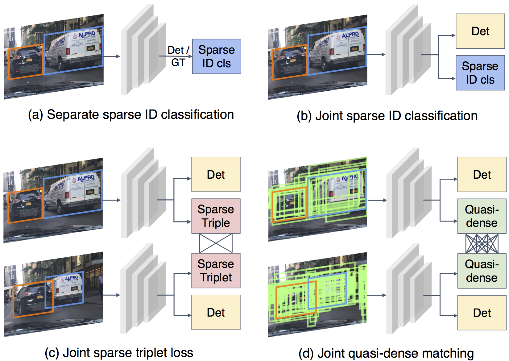

# Quasi-Dense Tracking

[](https://paperswithcode.com/sota/multiple-object-tracking-on-bdd100k?p=quasi-dense-instance-similarity-learning)
[](https://paperswithcode.com/sota/multiple-object-tracking-on-waymo-open?p=quasi-dense-instance-similarity-learning)

This is the offical implementation of paper [Quasi-Dense Similarity Learning for Multiple Object Tracking](https://arxiv.org/abs/2006.06664).

We present a [trailer](https://youtu.be/o8HRJAOZidc) that consists of method illustrations and tracking visualizations. Our project website contains more information: [vis.xyz/pub/qdtrack](https://www.vis.xyz/pub/qdtrack/).

If you have any questions, please go to [Discussions](https://github.com/SysCV/qdtrack/discussions).

## Abstract

Similarity learning has been recognized as a crucial step for object tracking. However, existing multiple object tracking methods only use sparse ground truth matching as the training objective, while ignoring the majority of the informative regions on the images. In this paper, we present Quasi-Dense Similarity Learning, which densely samples hundreds of region proposals on a pair of images for contrastive learning. We can naturally combine this similarity learning with existing detection methods to build Quasi-Dense Tracking (QDTrack) without turning to displacement regression or motion priors. We also find that the resulting distinctive feature space admits a simple nearest neighbor search at the inference time. Despite its simplicity, QDTrack outperforms all existing methods on MOT, BDD100K, Waymo, and TAO tracking benchmarks. It achieves 68.7 MOTA at 20.3 FPS on MOT17 without using external training data. Compared to methods with similar detectors, it boosts almost 10 points of MOTA and significantly decreases the number of ID switches on BDD100K and Waymo datasets.


## Quasi-dense matching


## Main results
Without bells and whistles, our method outperforms the states of the art on MOT, BDD100K, Waymo, and TAO benchmarks with ResNet-50 as the base model.


### BDD100K test set

| mMOTA | mIDF1  | ID Sw. |
|-------|--------|--------|
| 35.5  | 52.3   |  10790 |

### MOT

| Dataset | MOTA | IDF1  | ID Sw. | MT | ML |
|-------|--------|--------| ----| ---| ---|
| MOT16 | 69.8 | 67.1 | 1097 | 316 | 150 |
| MOT17 | 68.7 | 66.3 | 3378 | 957 | 516 |

### Waymo validation set

| Category   | MOTA | IDF1 | ID Sw. |
|------------|------|------|--------|
| Vehicle    | 55.6 | 66.2 | 24309  | 
| Pedestrian | 50.3 | 58.4 | 6347   |
| Cyclist    | 26.2 | 45.7 | 56     | 
| All        | 44.0 | 56.8 | 30712  | 

### TAO

| Split   | AP50 | AP75 | AP | 
|---------|------|------|----|
| val     | 16.1 | 5.0  | 7.0|
| test    | 12.4 | 4.5  | 5.2|


## Installation

Please refer to [INSTALL.md](docs/INSTALL.md) for installation instructions.


## Usages
Please refer to [GET_STARTED.md](docs/GET_STARTED.md) for dataset preparation and running instructions.

Trained models for testing

- [BDD100K model](https://drive.google.com/file/d/1YNAQgd8rMqqEG-fRj3VWlO4G5kdwJbxz/view?usp=sharing)
- [TAO model](https://drive.google.com/file/d/1JtZ9UA0-b9LDor1NHtk8A-g83X7-T89X/view?usp=sharing)

More implementations / models on the following benchmarks will be released later

- MOT16 / MOT17 / MOT20

Waymo models won't be available publicly due to the dataset license constraints.


## Citation

```
@InProceedings{qdtrack,
  title = {Quasi-Dense Similarity Learning for Multiple Object Tracking},
  author = {Pang, Jiangmiao and Qiu, Linlu and Li, Xia and Chen, Haofeng and Li, Qi and Darrell, Trevor and Yu, Fisher},
  booktitle = {IEEE/CVF Conference on Computer Vision and Pattern Recognition},
  month = {June},
  year = {2021}
}
```
